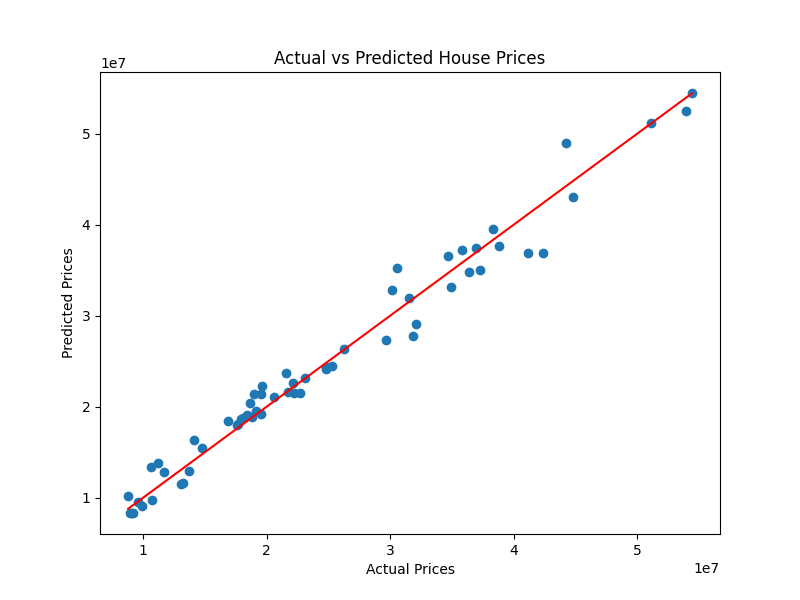

# Model Evaluation Report
House Price Prediction using Machine Learning

Author: Dhanashree Tankar

# 1. Overview

This report evaluates multiple machine learning models developed to predict house prices based on property features.

The models were trained and evaluated using the following features:

- Area
- Bedrooms
- Bathrooms
- Age
- Location
- Property Type

The objective is to determine which model provides the most accurate predictions for house prices.

# 2. Dataset Insights

Exploratory Data Analysis revealed several key relationships:

• House price increases significantly with larger area
• Location strongly influences property value
• City center properties have higher price distributions
• Property type also affects valuation

# 3. Visualization Results

## Area vs Price

The scatter plot shows a strong positive relationship between area and price.

Larger houses generally have higher prices.

## Location vs Price

The box plot indicates that houses in the **City Center** have significantly higher median prices compared to suburban and rural areas.

## Feature Importance

Random Forest feature importance analysis shows that **Area** is the most influential feature in predicting house prices.

Top features include:

1. Area
2. City Center location
3. Rural/Suburb location
4. Bedrooms

## Actual vs Predicted Prices

The prediction scatter plot shows that most predictions fall close to the ideal prediction line, indicating good model accuracy.

---

# 4. Model Performance Comparison

Four models were evaluated:

|             Model           |    MAE    |    RMSE   | R² Score|
|-----------------------------|-----------|-----------|---------|
| Linear Regression (Scratch) | 6,297,862 | 7,777,103 |   0.58  |
| Linear Regression           | 2,188,736 | 2,907,633 |   0.94  |
| Decision Tree               | 2,125,458 | 2,805,103 |   0.94  |
| Random Forest               | 1,431,714 | 1,908,160 | **0.97**|

# 5. Polynomial Regression Observation

Polynomial Regression achieved:

R² Score = **1.00**

While this indicates a perfect fit, such performance can often indicate **overfitting**, especially when the dataset is relatively small.

Therefore, Random Forest is considered the most reliable model for this task.

# 6. Cross Validation Results

5-Fold Cross Validation was performed on the Random Forest model.

Scores: [0.9871, 0.9504, 0.9736, 0.9712, 0.9841]

Average R² Score: 0.9733

This indicates that the model generalizes well across different data splits.

# 7. Hyperparameter Optimization

GridSearchCV was used to tune Random Forest hyperparameters.

Best parameters found: n_estimators = 200
                       max_depth = None
                       min_samples_split = 2

These parameters improved model stability and predictive performance.

# 8. Final Model Selection

Based on evaluation metrics and cross validation performance:

**Random Forest was selected as the final model.**

Reasons:

• Highest R² score (0.97)
• Lowest prediction error
• Strong generalization ability
• Handles nonlinear relationships effectively

# 9. Key Insights

1. Area is the most significant predictor of house price.
2. Properties located in the city center tend to be significantly more expensive.
3. Bedrooms and property type contribute moderately to price prediction.

# 10. Future Improvements

Possible improvements for this project include:

• Using a larger housing dataset
• Adding more location-based features (schools, transport, etc.)
• Hyperparameter tuning with larger search spaces
• Trying Gradient Boosting models such as XGBoost or LightGBM
• Deploying the model using a web application (Flask or Streamlit)

# 11. Conclusion

This project demonstrates the complete machine learning pipeline including:

- Data exploration
- Feature preprocessing
- Model development
- Model evaluation
- Hyperparameter tuning

Random Forest provided the most accurate and stable predictions for house prices.

The project highlights how machine learning can assist real estate professionals in making data-driven pricing decisions.
